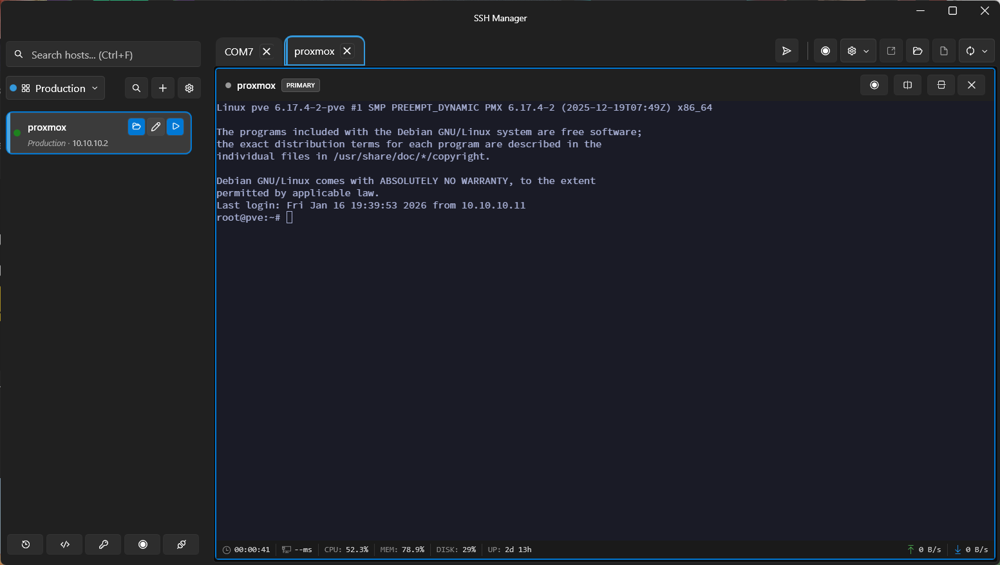

# SshManager

[](https://github.com/tomertec/sshmanager/actions/workflows/build.yml)
[](LICENSE)
[](https://dotnet.microsoft.com/download/dotnet/8.0)
[](https://www.microsoft.com/windows)

A modern Windows desktop application for managing SSH and serial port connections with an embedded terminal.



## Features

### SSH Connections
- **Host Management** - Store and organize SSH connections with groups
- **Embedded Terminal** - Full-featured terminal with xterm.js (vim, tmux, htop all work)
- **Multiple Tabs & Split Panes** - Work with multiple sessions side by side
- **Secure Credential Storage** - Passwords encrypted with Windows DPAPI
- **SSH Key Support** - SSH Agent, private key files, or password authentication
- **SSH Key Management** - Generate, import, and manage SSH keys with passphrase support
- **PPK Import Wizard** - Batch convert PuTTY keys to OpenSSH format
- **SFTP Browser** - Graphical file transfer with drag-and-drop
- **Port Forwarding** - Local and remote port forwarding profiles
- **Jump Hosts** - ProxyJump support for bastion/jump host connections
- **Import/Export** - Import from SSH config or PuTTY, backup to cloud

### Serial Port Connections
- **COM Port Support** - Connect to serial devices (routers, switches, embedded systems)
- **Full Configuration** - Baud rate, data bits, stop bits, parity, flow control
- **DTR/RTS Control** - Toggle hardware signals for device reset/boot modes
- **Local Echo** - Optional local character echo for half-duplex devices
- **Quick Connect** - Enumerate and connect to available COM ports instantly
- **Save & Organize** - Store serial port configurations alongside SSH hosts

### General
- **Modern UI** - Dark theme with Fluent Design (WPF-UI)
- **Session Recording** - Record and playback terminal sessions (ASCIINEMA format)

## Quick Start

### Prerequisites

- Windows 10/11 (64-bit)
- [.NET 8.0 SDK](https://dotnet.microsoft.com/download/dotnet/8.0) or later
- WebView2 Runtime (pre-installed on Windows 10/11)

### Build & Run

```bash
# Clone the repository
git clone https://github.com/tomertec/sshmanager.git
cd sshmanager

# Build
dotnet build SshManager.sln

# Run
dotnet run --project src/SshManager.App/SshManager.App.csproj
```

### Download Release

Check the [Releases](https://github.com/tomertec/sshmanager/releases) page for pre-built binaries.

## Usage

1. **Add a host**: Click the **+** button and enter connection details
2. **Connect**: Double-click a host or press Enter
3. **Organize**: Create groups to organize your hosts
4. **Split panes**: Right-click a tab to split horizontally/vertically

For detailed usage instructions, see the [Getting Started Guide](docs/GETTING_STARTED.md).

## Documentation

- [Getting Started](docs/GETTING_STARTED.md) - First-time setup and basic usage
- [Full Documentation](docs/README.md) - Complete feature documentation
- [Architecture](docs/ARCHITECTURE.md) - Technical architecture details
- [API Reference](docs/API.md) - Terminal services API for developers

## Technology Stack

| Component | Technology |
|-----------|------------|
| Framework | .NET 8, WPF |
| UI Library | [WPF-UI](https://github.com/lepoco/wpfui) (Fluent Design) |
| MVVM | [CommunityToolkit.Mvvm](https://github.com/CommunityToolkit/dotnet) |
| Database | SQLite via EF Core |
| SSH | [SSH.NET](https://github.com/sshnet/SSH.NET) |
| Serial | System.IO.Ports + [RJCP.SerialPortStream](https://github.com/jcurl/RJCP.DLL.SerialPortStream) |
| Terminal | [xterm.js](https://xtermjs.org/) via WebView2 |

## Building from Source

```bash
# Debug build
dotnet build SshManager.sln

# Release build
dotnet build SshManager.sln -c Release

# Run tests
dotnet test

# Publish self-contained executable
dotnet publish src/SshManager.App/SshManager.App.csproj -c Release -r win-x64 --self-contained
```

## Contributing

Contributions are welcome! Please feel free to submit a Pull Request.

1. Fork the repository
2. Create your feature branch (`git checkout -b feature/amazing-feature`)
3. Commit your changes (`git commit -m 'Add amazing feature'`)
4. Push to the branch (`git push origin feature/amazing-feature`)
5. Open a Pull Request

## Building and Releasing

SshManager uses **Velopack** for installer creation and automatic updates.

### Quick Build
```bash
# Install Velopack CLI
dotnet tool install -g vpk

# Build a release
.\build-release.ps1 -Version "1.0.0"
```

### Publishing Updates
See [VELOPACK_INTEGRATION.md](VELOPACK_INTEGRATION.md) for complete instructions on:
- Building installers
- Publishing releases to GitHub
- Creating delta updates
- Adding update UI to the app

## License

This project is licensed under the MIT License - see the [LICENSE](LICENSE) file for details.

## Acknowledgments

- [SSH.NET](https://github.com/sshnet/SSH.NET) - SSH library for .NET
- [RJCP.SerialPortStream](https://github.com/jcurl/RJCP.DLL.SerialPortStream) - Cross-platform serial port library
- [WPF-UI](https://github.com/lepoco/wpfui) - Modern WPF controls
- [xterm.js](https://xtermjs.org/) - Terminal emulator for the web
- [CommunityToolkit.Mvvm](https://github.com/CommunityToolkit/dotnet) - MVVM framework
