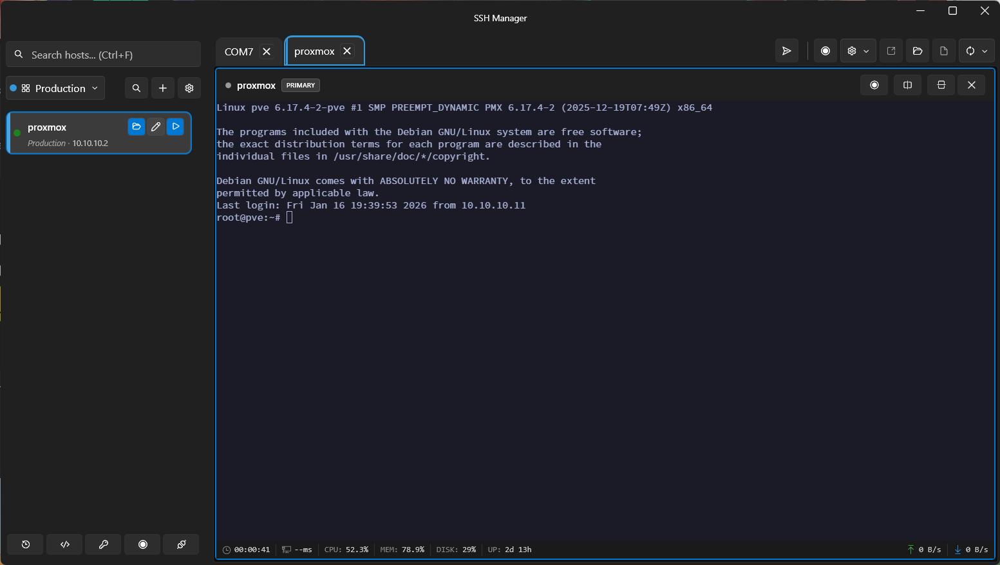

# SshManager

[](https://github.com/tomertec/sshmanager/actions/workflows/build.yml)
[](LICENSE)
[](https://dotnet.microsoft.com/download/dotnet/9.0)
[](https://www.microsoft.com/windows)

A modern Windows desktop application for managing SSH and serial port connections with an embedded terminal.



## Features

### SSH Connections
- **Host Management** - Store and organize SSH connections with groups and tags
- **Embedded Terminal** - Full-featured terminal with xterm.js (vim, tmux, htop all work)
- **Multiple Tabs & Split Panes** - Work with multiple sessions side by side
- **Quick Connect (Ctrl+K)** - Command palette-style fuzzy search across all hosts
- **Broadcast Input** - Send commands to multiple terminals simultaneously

### Authentication
- **SSH Agent** - Pageant, Windows OpenSSH Agent, or 1Password SSH Agent
- **Private Key Files** - With optional passphrase and SSH key management
- **Password** - Encrypted with Windows DPAPI (per-user, at rest)
- **Kerberos/GSSAPI** - Windows domain authentication with credential delegation
- **1Password Integration** - Fetch passwords and SSH keys from 1Password vaults at connection time via `op://` secret references

### SFTP File Browser
- **Dual-Pane Browser** - Local and remote side-by-side file management
- **Drag-and-Drop** - Transfer files between local and remote panels
- **Folder Upload/Download** - Recursive directory transfers
- **Remote File Editor** - Edit remote files with syntax highlighting (AvalonEdit)
- **Move, Rename, Delete** - Full file operations via right-click context menu
- **Bookmarks & Favorites** - Quick access to frequently used remote paths

### SSH Key Management
- **Generate Keys** - Create RSA, Ed25519, ECDSA keys
- **PPK Import Wizard** - Batch convert PuTTY keys to OpenSSH format
- **Key Encryption** - Re-encrypt private keys with new passphrases
- **Agent Management** - Add/remove keys from SSH agents programmatically

### Advanced SSH
- **Port Forwarding** - Local, remote, and dynamic (SOCKS) port forwarding profiles
- **Jump Hosts** - ProxyJump support for multi-hop bastion connections
- **Visual Tunnel Builder** - Graph-based editor for complex tunnel configurations
- **X11 Forwarding** - Forward graphical applications with auto-detection
- **Connection Pooling** - Reuse SSH connections for SFTP operations
- **Auto-Reconnect** - Automatic reconnection with exponential backoff
- **Per-Host Keep-Alive** - Configurable keep-alive intervals per host

### Serial Port Connections
- **COM Port Support** - Connect to serial devices (routers, switches, embedded systems)
- **Full Configuration** - Baud rate, data bits, stop bits, parity, flow control
- **DTR/RTS Control** - Toggle hardware signals for device reset/boot modes
- **Local Echo** - Optional local character echo for half-duplex devices
- **Quick Connect** - Enumerate and connect to available COM ports instantly
- **Save & Organize** - Store serial port configurations alongside SSH hosts

### Session Management
- **Session Recording** - Record and playback terminal sessions (ASCIINEMA v2 format)
- **Session Recovery** - Restore sessions after crashes or disconnections
- **Command Snippets** - Save and reuse frequently used commands
- **Terminal Autocompletion** - Intelligent command completion

### Import/Export & Sync
- **SSH Config** - Import from and export to `~/.ssh/config`
- **PuTTY Import** - Import sessions from PuTTY registry
- **Cloud Sync** - Sync hosts across devices via OneDrive
- **Backup/Restore** - Database backup and restore

### General
- **Modern UI** - Dark theme with Fluent Design (WPF-UI)
- **System Tray** - Minimize to tray with quick-connect menu
- **Terminal Themes** - Customizable terminal color schemes
- **Host Status Monitoring** - Ping-based availability checks

## Quick Start

### Prerequisites

- Windows 10/11 (64-bit)
- [.NET 9.0 SDK](https://dotnet.microsoft.com/download/dotnet/9.0) or later
- WebView2 Runtime (pre-installed on Windows 10/11)

### Download Release

Download the latest single-file executable from the [Releases](https://github.com/tomertec/sshmanager/releases) page. No installation required.

### Build & Run

```bash
git clone https://github.com/tomertec/sshmanager.git
cd sshmanager
dotnet build SshManager.sln
dotnet run --project src/SshManager.App/SshManager.App.csproj
```

## Usage

1. **Add a host** - Click **+** and enter connection details
2. **Connect** - Double-click a host or press Enter
3. **Organize** - Create groups and apply tags
4. **Transfer files** - Right-click a connected host and open SFTP browser
5. **Split panes** - Right-click a tab to split horizontally/vertically

For detailed usage instructions, see the [Getting Started Guide](docs/GETTING_STARTED.md).

### 1Password Integration

SshManager can fetch SSH passwords and private keys from 1Password at connection time:

1. Install the [1Password desktop app](https://1password.com/downloads) with CLI integration enabled (Settings > Developer)
2. In the host edit dialog, select **1Password** as the authentication type
3. Click **Browse** to select a vault item and field
4. On connection, SshManager resolves the `op://` reference via biometric unlock (Windows Hello)

Both passwords and SSH private keys are supported. Keys are written to secure temp files with restrictive ACLs and securely deleted after the session ends.

## Documentation

- [Getting Started](docs/GETTING_STARTED.md) - First-time setup and basic usage
- [Full Documentation](docs/README.md) - Complete feature documentation
- [Architecture](docs/ARCHITECTURE.md) - Technical architecture details
- [API Reference](docs/API.md) - Terminal services API for developers

## Technology Stack

| Component | Technology |
|-----------|------------|
| Framework | .NET 9, WPF |
| UI Library | [WPF-UI](https://github.com/lepoco/wpfui) (Fluent Design) |
| MVVM | [CommunityToolkit.Mvvm](https://github.com/CommunityToolkit/dotnet) |
| Database | SQLite via EF Core 9 |
| SSH | [SSH.NET](https://github.com/sshnet/SSH.NET) |
| Serial | System.IO.Ports + [RJCP.SerialPortStream](https://github.com/jcurl/RJCP.DLL.SerialPortStream) |
| Terminal | [xterm.js](https://xtermjs.org/) via WebView2 |
| Credentials | Windows DPAPI + [1Password CLI](https://developer.1password.com/docs/cli/) |
| Logging | [Serilog](https://serilog.net/) |

## Building from Source

```bash
# Debug build
dotnet build SshManager.sln

# Release build
dotnet build SshManager.sln -c Release

# Run tests
dotnet test

# Publish self-contained executable
dotnet publish src/SshManager.App/SshManager.App.csproj -c Release -r win-x64 --self-contained true -p:PublishSingleFile=true
```

## Contributing

Contributions are welcome! Please feel free to submit a Pull Request.

1. Fork the repository
2. Create your feature branch (`git checkout -b feature/amazing-feature`)
3. Commit your changes (`git commit -m 'Add amazing feature'`)
4. Push to the branch (`git push origin feature/amazing-feature`)
5. Open a Pull Request

## License

This project is licensed under the MIT License - see the [LICENSE](LICENSE) file for details.

## Acknowledgments

- [SSH.NET](https://github.com/sshnet/SSH.NET) - SSH library for .NET
- [RJCP.SerialPortStream](https://github.com/jcurl/RJCP.DLL.SerialPortStream) - Cross-platform serial port library
- [WPF-UI](https://github.com/lepoco/wpfui) - Modern WPF controls
- [xterm.js](https://xtermjs.org/) - Terminal emulator for the web
- [CommunityToolkit.Mvvm](https://github.com/CommunityToolkit/dotnet) - MVVM framework
- [1Password CLI](https://developer.1password.com/docs/cli/) - Credential management
